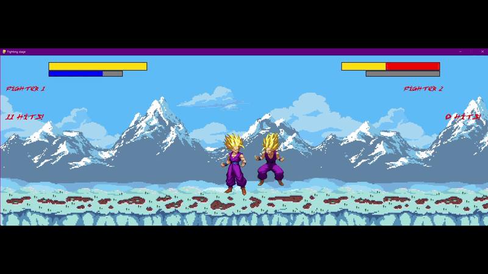
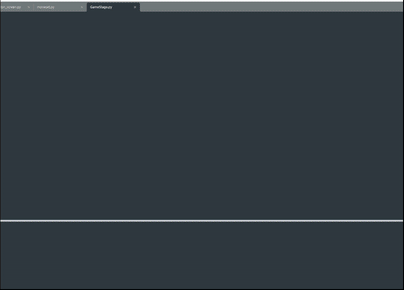

# A 2D street fighter like project I made using Pygame, featuring input handling, game state management, sprite animations, basic gameplay mechanics and a main menu.

Small demo of the gameplay showcasing some basic attacks I added, alongside healthbars sprite animations and a hitbox system.

This here is the main menu showing a button system which can be used to navigate within the menu additionally providing an option for the player to toggle between their preferred input method. 
When the play button is pressed, the screen switches to the character select screen showcasing some additional GUI elements I have implemented.

DISCLAIMER: A lot of the features I have shown are still experimental and still do not work as intended, with some additional bugs that are yet to be fixed. Nonetheless I really enjoyed working on this project as it also introduced me to OOP to modularise code to improve both maintability and reusability. It was also great interacting with the Pygame community where I had the opportunity to communicate with more experienced developers helping me with debugging as well as learning new concepts!

 

